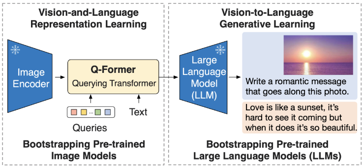

# BLIP2-HF-Captioning
Beginner-Friendly BLIP-2 Fine-Tuning & Inference Toolkit for Image Captioning (Hugging Face + PyTorch)


## 1. Project Description

**BLIP-2** (Bootstrapped Language-Image Pretraining) is a powerful vision-language model introduced by Salesforce Research. It bridges vision encoders and language models through a lightweight **Querying Transformer (Q-Former)**, enabling efficient image-to-text understanding and generation. BLIP-2 achieves state-of-the-art results in a wide range of V+L tasks such as image captioning, VQA, and more.

<div align="center">
  
  <br />
  <em>Figure: BLIP-2 model architecture (Image credit: Salesforce Research)</em>
</div>


BLIP2-HF-Captioning is an open-source, beginner-friendly toolkit for fine-tuning and inference of BLIP-2 vision-language models using Hugging Face Transformers and PyTorch.
This project provides a modular pipeline for image captioning tasks, supporting rapid dataset preparation, efficient fine-tuning, and easy deployment for real-world applications.

Ideal for:

- Vision-language AI researchers

- Robotics and smart factory developers

- Machine learning students & educators

- Anyone interested in multimodal AI

While the original [LAVIS library](https://github.com/salesforce/LAVIS) by Salesforce provides comprehensive support for BLIP and BLIP-2 (including training pipelines and multiple model variants), this project is based on the [Hugging Face Transformers implementation](https://github.com/huggingface/transformers), which offers a more modular interface and native compatibility with the Hugging Face ecosystem. The HF version is especially convenient for inference and beginner-friendly fine-tuning using the `Trainer` API.

## 2. Features & Highlights
- Beginner-friendly: Clear documentation and simple scripts for fast onboarding.

- BLIP-2 Fine-Tuning: Full pipeline for dataset preparation, training, and evaluation.

- Hugging Face Transformers Compatible: Leverage state-of-the-art VLMs.

- PyTorch Ecosystem: Robust, GPU-accelerated training and inference.

- Easy Inference: Ready-to-use scripts for generating captions on your own images.

- Modular Design: Easily adaptable for new datasets and downstream applications.

- TensorBoard Support: Built-in visualization for training curves and evaluation.


## 3. Project Structure
The project is organized as follows:

```plaintext

BLIP2_HF_V2/
├── image_train/                        # Training dataset directory
│  
├── image_test/                         # Test images for inference
│   └── (example input images)
│
├── annotations.json                    # Original annotation file (image-text pairs)
├── main.py                             # Inference script using BLIP2-Flan-T5-XL
├── train_blip2_captioning.py           # Main training script for fine-tuning BLIP2
├── test_env.py                         # Script to test model and processor loading
├── test_requirements.py                # Script to verify environment dependencies
├── requirements.txt                    # Python dependencies list
│
├── .gitignore                          # Git ignore rules
├── .gitattributes                      # Git attribute settings
└── README.md                           
```
## 4. Installation and Environment Setup
This project relies on the latest source version of Hugging Face Transformers to support BLIP-2 models such as blip2-flan-t5-xl, and requires a GPU-compatible installation of PyTorch.

⚠️ **It is strongly recommended to follow the steps below to manually configure your environment, especially to avoid errors related to missing arguments like num_query_tokens that may not be supported in pre-built transformers wheels.**

Create a Python environment (Recommended: Python 3.9 or 3.10)

With Conda：

```bash
conda create -n blip2_env python=3.9 -y
conda activate blip2_env
```

Install PyTorch (choose CUDA version based on your server; example: CUDA 11.8)

```bash
pip install torch==2.6.0+cu118 torchvision==0.22.0+cu118 torchaudio==2.6.0+cu118 \
--index-url https://download.pytorch.org/whl/cu118
```

For other CUDA versions, refer to: https://pytorch.org/get-started/locally/

Install Transformers from Source + Other Dependencies

```bash
git clone https://github.com/huggingface/transformers.git ./src/transformers
pip install -e ./src/transformers[torch]

pip install -r requirements.txt
```

Verify Your Installation

```bash
python -c "import torch; print(torch.cuda.is_available())"
```
## 5. Usage & Training

### 5.1 Inference with Pretrained BLIP2

Run `main.py` to perform image captioning using the [BLIP2-Flan-T5-XL](https://huggingface.co/Salesforce/blip2-flan-t5-xl) model:

```bash
python main.py
```

* Test images should be placed in the `image_test/` directory.
* You can customize the prompt inside `main.py` to fit your task.

---

### 5.2 Fine-Tuning BLIP2 on Custom Data

To fine-tune the BLIP2 model with your own image-caption dataset:

```bash
python train_blip2_captioning.py
```

* The training script expects a `annotations.json` file in COCO format under `image_train/`.
* It will automatically generate training and validation splits (`train_split.jsonl` and `val_split.jsonl`).
* You can customize training parameters (e.g. batch size, learning rate, output directory) directly in the script.

## 6. License

This project is licensed under the MIT License – see the [LICENSE](./LICENSE) file for details.

---

## 🔍 Keywords

BLIP-2 captioning, image-text dataset, Hugging Face Transformers, fine-tuning vision-language models, PyTorch training, beginner-friendly multimodal project, inference-ready pipeline, GPU-compatible training, custom annotation format, BLIP2-Flan-T5-XL integration.

---
